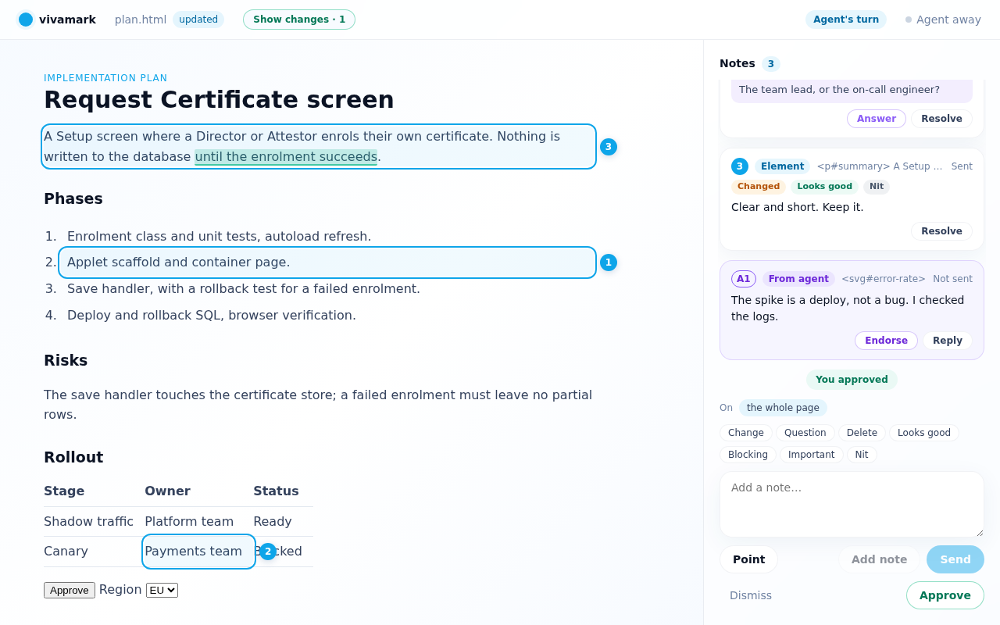
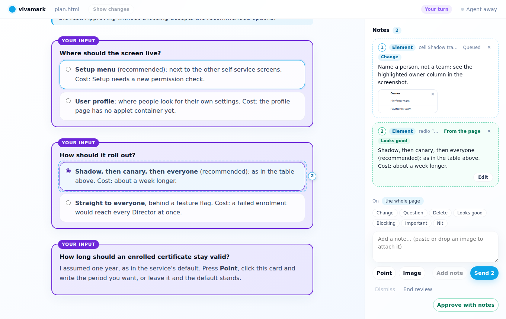

# vivamark

**Make an agent's page alive.** vivamark opens a plan, report or diff that an AI
coding agent wrote, as HTML or Markdown, in your browser. You point at what you
mean: a paragraph, a table cell, a line of a diff. You say what you want, and
the agent receives each note tied to exactly that spot. It edits the file, the
page updates in place, and the conversation carries on until you approve.

> **Status: early.** The core loop works (`open`, `wait` and `reply` on an
> HTML or Markdown file), with the first-version features F1–F8: decisions,
> "what changed", notes that re-attach after edits, intent and severity,
> Markdown with line ranges, per-note replies with whose turn it is, notes
> from the agent, and named table cells, controls and chart points. Notes can carry images, and a
> page can ask for a decision with real controls the reviewer clicks. A
> supervisor can follow reviews with `status`, the event log and a notify
> hook, and either side can `end` a review. `vivamark guide` teaches any
> agent to write pages worth reviewing. See
> [`docs/DECISIONS.md`](docs/DECISIONS.md) for what has been decided and
> [`docs/research/`](docs/research/) for how we got there.

## Try it

You need Node 20 or newer. From a clone of this repository:

```sh
npm ci
npm run build
node dist/cli.js open examples/plan.html
```

Your browser opens the review page. If it does not, open the URL that the
command printed. If your browser reaches this machine through a port forwarder
(VS Code's WSL forwarding, `ssh -L`), keep the path and the `#t=` part of the
URL and change only the port to the forwarded one. In a second terminal, play
the agent:

```sh
node dist/cli.js wait examples/plan.html
```

On the page, select some text, or press **Point** and click an element: a
paragraph, a table cell (named by its row and column), one of the options in
**Decisions for you**, a spot on the chart, or on other pages a button (named
by its label). Type a note, pick an intent (Change, Question,
Delete, Looks good) and a severity if you like, and press **Add note**. On a
queued note, one key does the same: C Q D G for the intent, B I N for the
severity. To show what you mean, attach an image: paste a screenshot (Ctrl+V)
into the note, drop an image on the note or on a queued note, or press
**Image**. Each shows as a thumbnail you can remove before sending. Then
decide:

- **Send** requests changes. `wait` prints each note with what it points at
  (an id or selector, the quoted text, the lines in the file) and any images
  (as local paths the agent can open), and exits 0.
- **Approve** (or **Approve with notes**, when notes are queued) exits 6.
- **Dismiss** closes the round with nothing and exits 7.

Only real PNG, JPEG, GIF and WebP images are accepted, checked by their
content: about 10 MB each and 25 MB per note (`VIVAMARK_MAX_IMAGE_BYTES`,
`VIVAMARK_MAX_NOTE_IMAGE_BYTES`, or `max_image_bytes` and
`max_note_image_bytes` in the config file). They are kept in the state
directory under `attachments/<session>/`, named by their hash, and never next
to the reviewed file. In `wait --json` each note's `attachments` lists
`{id, path, mime, width, height, bytes}`; the image itself is never inlined.

Answer on the page, as a whole or note by note:

```sh
node dist/cli.js reply examples/plan.html -m "Split step 2 as asked."
node dist/cli.js reply examples/plan.html --note n_0001 --status addressed
node dist/cli.js reply examples/plan.html --note n_0002 --status question -m "Which owner?"
```

A question shows on that note's card with an **Answer** button; the answer
comes back to `wait` as a new note with `"answers": "n_0002"`. Only the
reviewer resolves a note. The page and `wait` both say whose turn it is.

Edit `examples/plan.html` and the page reloads in place. Every note is
re-attached to the new file: `anchored`, `moved` (with where it is now), or
`orphaned` when what it pointed at is gone, listed apart and never pinned to a
guess. **Show changes** highlights what changed since you last sent. Running
`wait` again returns the same notes; `wait examples/plan.html --after <seq>`
waits for newer ones.

The agent, or a tool, can point things out to the reviewer. Such a note is
shown labelled with its source and reaches `wait` only if the reviewer
endorses it or replies to it:

```sh
node dist/cli.js note add examples/plan.html --target '#step-3' --text "I guessed this order." --source agent
```

Markdown works the same way, and each note carries `lines: [first, last]` in
the source:

```sh
node dist/cli.js open examples/plan.md
```

`node dist/cli.js --help` lists every option and what `wait` returns;
`node dist/cli.js stop` stops the background server.



## Writing a page worth reviewing

`vivamark guide` tells an agent how to run a review and how to write the page:
the loop and how to wait from an agent harness, the Smooth glass look as a
ready CSS block that fetches nothing, stable ids on everything worth a note
(so notes survive edits), decisions laid out as options to point at, and a
playbook each for a plan, a report, a comparison, an explainer and a diff.

```sh
node dist/cli.js guide            # the topics
node dist/cli.js guide plan       # one topic
node dist/cli.js guide ids --json # the same, as data
```

[`examples/plan.html`](examples/plan.html) follows the `plan` playbook and the
`design` CSS. Each decision sits in a "Your input" card with real radio
buttons marked `data-vivamark-suggest="looks-good"`. Clicking one queues a
note, marked "From the page", with the option's label and id: one per group,
replaced when the choice changes. Nothing is sent by the click; the reviewer
sends it with the rest, and can edit or remove it first. Only a real click
counts, not an event a page script fakes. A free-form question is a card to
point at instead.



For agents that load Agent Skills,
[`skills/vivamark/SKILL.md`](skills/vivamark/SKILL.md) says what vivamark is
for and sends the agent to `vivamark guide`. It holds no rules of its own, so
it cannot drift from the installed CLI. It is generated from the guide's text:
after changing `src/guide.ts`, run `npm run skill`; a test fails when the
committed stub is out of date.

## Ending a review

When the work is done, the agent ends the review, with a message if it likes:

```sh
node dist/cli.js end examples/plan.html -m "Merged. Thanks for the review."
```

The reviewer can do the same with **End review** on the page. Either way the
page shows that the review has ended, nothing more can be sent, and `wait`
returns status `ended` with **exit code 3**. Notes the reviewer sent before
the end are still delivered first. Running `open` on the same file later
starts a fresh review; the ended one is never revived.

If the reviewer closes the review page, no notes can come, so `wait` does not
hang: once the page has been gone for a grace period (about 10 seconds,
`VIVAMARK_DISCONNECT_GRACE_MS`), it returns status `disconnected` with **exit
code 4**. Nothing is consumed. A page that reconnects within the grace (a
reload, a brief network blip) keeps it waiting. `open` brings the page back.
This applies only after a page has connected to the review at least once:
until then `wait` keeps waiting, however long the reviewer takes to open or
paste the URL.

## Watching reviews from outside

These are for supervisors, editors and notifiers. None of them takes notes
from the agent, and vivamark does not know who uses them.

`status` answers at once, never blocks and never moves a cursor:

```sh
node dist/cli.js status examples/plan.html --json
node dist/cli.js status --owner supervisor   # every session, counted from that owner's cursor
```

For each session it gives open or ended, the notes pending after the owner's
cursor (default `agent`), the last seq, the last decision, whose turn it is,
the reviewer's page (`connected`, `disconnected`, or `never-opened` when no
page has connected yet), whether the agent is listening, and
the labels from `open --label k=v`. A file or session that has no review exits
1 and says so.

Every review is also recorded in `events.jsonl` in the state directory
(`~/.local/state/vivamark` by default): append-only, one JSON object per line,
each with `seq`, `at`, `type`, `session`, `file` and `labels`. The types are
`session.opened`, `feedback.sent` (with a count of `attachments`), `reply.posted`, `note.status`,
`agent-note.added`, `session.ended`, `browser.connected` and
`browser.disconnected`. **Events carry metadata only:** ids, counts, decisions
and statuses, never a note, quote, reply, message, image or image path. Read the words with
`wait`.

```sh
node dist/cli.js events --after 120 --json
node dist/cli.js events --follow             # keep printing until interrupted
```

`events` reads the log only; it needs neither the server nor a browser.

To run a command for every event (a desktop notification, a chime, a wake-up
for an orchestrator), set a notify hook. Only you can set it, in your
environment or your config file; nothing on a page or in a request can:

```sh
export VIVAMARK_NOTIFY_CMD='notify-send vivamark "$(jq -r .type)"'
```

or, in `~/.config/vivamark/config.json` (`$XDG_CONFIG_HOME/vivamark/`):

```json
{ "notify_cmd": "/home/me/bin/on-review-event", "notify_timeout_ms": 5000 }
```

The server runs the command once per event with that event's JSON on stdin.
It does not wait for it, never retries it, and kills it after 5 seconds; a
failing or slow command is logged in `daemon.log` and otherwise ignored. The
server reads the setting when it starts (an environment variable from the
command that started it), so run `vivamark stop` after changing it.

### Exit codes of `wait`

| Code | Meaning |
|---|---|
| 0 | Notes: the reviewer requests changes |
| 6 | Approved, or approved with notes |
| 7 | Dismissed: the round closed with nothing |
| 3 | Ended: the agent or the reviewer ended the review |
| 4 | Disconnected: the review page, once opened, has been gone for the grace period; nothing consumed |
| 5 | Timeout (`--timeout`) |
| 1 | Error |
| 130 / 143 | Interrupted; safe to re-run |

## What it will be

- **A CLI any agent can drive**: `vivamark open`, `wait`, `reply`, `status`,
  and `guide` to learn the rest.
  Works with Claude Code, Codex, Copilot CLI, Cursor, or a plain shell; no
  orchestrator required.
- **Local only.** The review server listens on this machine and nowhere else.
  No telemetry, ever. Nothing is published to third-party hosts.
- **Your file stays yours.** Serving a page adds one script tag; the saved file
  opens the same without vivamark.
- **Only you can send.** Scripts on the agent's page can suggest notes, and a
  control on it can queue your choice; only a deliberate click on Send
  reaches the agent.

## Prior art

vivamark learns from [lavish-axi](https://github.com/kunchenguid/lavish-axi)
(MIT) and [pointback](https://github.com/Abhijeet34/pointback) (Apache-2.0).
Any code taken from either keeps its notice; see
[`THIRD-PARTY-NOTICES.md`](THIRD-PARTY-NOTICES.md).

## Licence

[MIT](LICENSE).
